# Chapter 01: FACTS Concept and General System Considerations

## Table of Contents

- [Chapter 01: FACTS Concept and General System Considerations](#chapter-01-facts-concept-and-general-system-considerations)
	- [Table of Contents](#table-of-contents)
	- [Transmission Interconnections](#transmission-interconnections)
		- [Advantages of transmission line interconnections](#advantages-of-transmission-line-interconnections)
		- [Disadvantages of transmission line interconnections](#disadvantages-of-transmission-line-interconnections)
	- [Flow of Power in an AC System](#flow-of-power-in-an-ac-system)
		- [Cases of load flow](#cases-of-load-flow)
	- [Limits of TL loading capability](#limits-of-tl-loading-capability)
		- [Thermal](#thermal)
		- [Dielectric](#dielectric)
		- [Stability](#stability)
	- [Power Flow and Dynamic Stability](#power-flow-and-dynamic-stability)
	- [Basic Types of FACTs Controllers](#basic-types-of-facts-controllers)
		- [Series Controllers](#series-controllers)
		- [Shunt Controllers](#shunt-controllers)
		- [Combined series-series controllers](#combined-series-series-controllers)
		- [Combined series-shunt controllers](#combined-series-shunt-controllers)
		- [Thyristor controlled Reactor (TCR)](#thyristor-controlled-reactor-tcr)
		- [Thyristor Switched Reactor (TSR)](#thyristor-switched-reactor-tsr)
		- [Thyristor Switched Capacitor (TSC)](#thyristor-switched-capacitor-tsc)
		- [Static Var Compensator](#static-var-compensator)
		- [STATCOM](#statcom)
		- [Thyristor Controlled Series Capacitor (TCSC)](#thyristor-controlled-series-capacitor-tcsc)
		- [Thyristor Controlled Series Reactor (TCSR)](#thyristor-controlled-series-reactor-tcsr)
		- [Thyristor Switched Series Reactor (TSSR)](#thyristor-switched-series-reactor-tssr)
		- [Static Series Synchronous Compensator (SSSC)](#static-series-synchronous-compensator-sssc)
		- [Unified Power Flow Controller (UPFC)](#unified-power-flow-controller-upfc)
		- [Interline Power Flow Controller (IPFC)](#interline-power-flow-controller-ipfc)
	- [Power Electronics in FACTs](#power-electronics-in-facts)
		- [Thyristor](#thyristor)
		- [Thyristor and GTO](#thyristor-and-gto)
			- [Turn-On Operation](#turn-on-operation)
			- [Turn-Off Operation](#turn-off-operation)
			- [Comparison with Thyristor](#comparison-with-thyristor)
		- [BJT and IGBT](#bjt-and-igbt)
			- [BJT](#bjt)
			- [IGBT](#igbt)
		- [Comparisons](#comparisons)
	- [Practical Cases](#practical-cases)

## Transmission Interconnections

Most if not all of the world's electric power supply systems are
widely interconnected, involving connections:
- Inside utilities' own territories which extend to
- Inter-utility interconnections and then to
- Inter-regional and
- International connections.

This is done for **economic reasons**, to reduce the cost of
electricity and to improve reliability of power supply.

<table style="margin: 20px auto;">
	<tr>
		<td>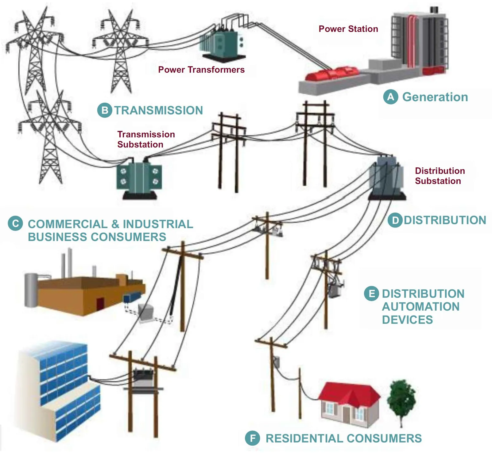</td>
		<td>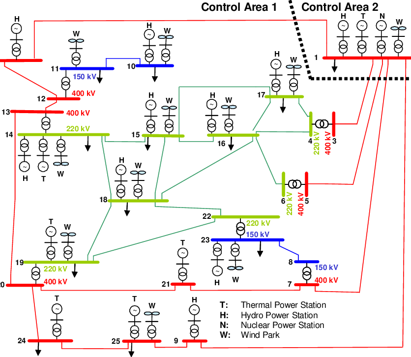</td>
	</tr>
	<tr>
		<td style="text-align:center"><b>Radial System</b></td>
		<td style="text-align:center"><b>Interconnectrd System</b></td>
	</tr>
</table>

### Advantages of transmission line interconnections

- **Capital cost reduction**
  > In an incremental system, it is possible to have larger generators rating because excess capacity of a'station may be utilized by the areas fed by other station’s as **the size of the generator increases the capital Cost per kW reduce.** Therefore, a saving is achieved capital cost. it is most useful advantages of interconnected system.

- **Installed Capacity Saving**
	> An interconnection is likely to decrease the installed capacity need to meet the load requirement. In majority of cases, it happens that **the maximum demand of one area does not coincide with the maximum demand of another area.** This could be because in one agea the major load is the industrial load while, in the other it is residential and commercial. If two such areas are interconnected, the diversity of load would cause the maximum combined demand to be less than the sun of the individual maximum demand.

- **Operating Savings**
	> When two different utilities are operating separately, each would run its units most economically. however, when the two are interconnected and the optimum scheduling is decided for the combined system, the operating costs are likely to decrease. Thus, energy interchanges between the^wo would result in saving for both. It is basic interconnected power system advantages.

- **Increase in Service Reliability**
   > Every equipment is prone to putage during its operation. System interconnection leads to increase in reliability of electric supply, in the event of one utility falling short of generation, due to forced outage of generator or unexpected increase in demand, another utility of the pool can come to its rescue by making its surplus power available. An interconnection between the local transmission systems of two utility can lead to an increase in service reliability at considerably less expense than that which both would have to incur in the construction of additional lines. When the lines are fed from more than one-generation source, the reliability is still further improved.

- **Decrease in Spinning Reserve Requirements**
 	> Every utility has to keep some generation capacity as reserve to take into account of capacity reduction due to forced outage and scheduled maintenance. as a thumb rule, a capacity equal to the capacity of the largest unit is kept as reserve. When two systems operate separately, each has to maintain a separate reserve capacity. If they are interconnected, it may be sufficient to have a smaller total reserve for the combine system for the same degree and reliability.

- **Addition and Replacement of Transmission Facilities**
   > Load growth necessitates additionl transmission facilities the questions like cost or right of way and installation of line and the Territory to be served can be more economically and easily decided when bmore than one utility is involved. The utilities can share the cost and use of the lines. This would evidently lead to optimum use of facilities.

### Disadvantages of transmission line interconnections

- **Expensive Circuit Breakers**
   > Interconnection causes larger curents to flow on the transmission lines under faulty condition with a consequent Increase in capacity of circuit breakers therefore, expensive circuit breakers are required with interconnected system.

- **Expensive tie Lines**
 	> Interconnection of generating station involves expenses for construction of interconnecting transmission line between generating stations or arias. These lines are called tie lines.

- **Synchronizing Problem**
   > The generators of al£ the inter-connected generating stations must operate at all same frequency and in a synchronized manner.

- **Inadequate Transmission Facilities**
   > The transmission system has not been strengthened to proper level. This has resulted in problem of power evaluation from large pithead super thermal station. Additional investment in transmissioin system is needed. There should be adequate redundancy in transmission system for satisfactory operation of grid.

- **Metering and Instrumentation**
   > Adequate metering and instrumentation is needed at different level. It is necessary to install sequential recorders, disturbance recorders, time of day meters etc.

## Flow of Power in an AC System
 In ac power systems, given the insignificant electrical storage, the electrical generation and load must balance at all times.

<figure style="margin: 20px auto; text-align: center;">
    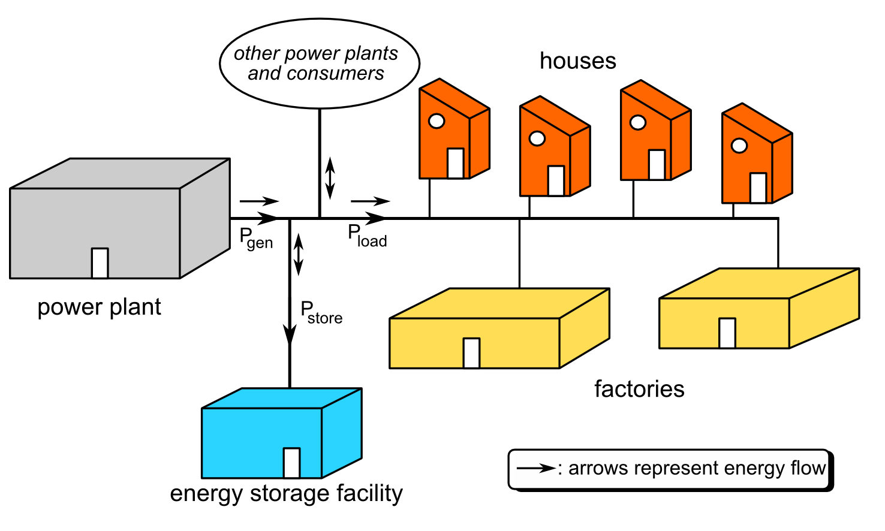
    <figcaption><b>Flow of Power</b></figcaption>
</figure>

> To some extent, the electrical system is self-regulating.

 If generation is less than load, the voltage and frequency drop, and thereby the load, goes down to equal the generation minus the transmission losses.
> However, there is only a few percent margin for such a self-regulation.

*What happened if exceeding the margin of self-regulation?*

- If voltage is propped up with reactive power support, then the load will go up, and consequently frequency will keep dropping, and the system will collapse.
- Alternately, if there is inadequate reactive power, the system can have voltage collapse.

**Solutions**

- Parallel circuits
- Meshed circuits
- Interconnected system

### Cases of load flow

 Consider power flow through two parallel paths (possibly corridors of several lines) from a surplus generation area, shown as an equivalent generator on the left, to a deficit generation area on the right.

<figure style="margin: 20px auto; text-align: center;">
    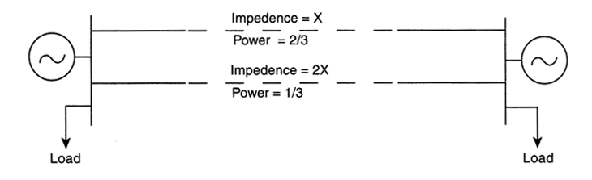
    <figcaption><b>(a) ac power flow with parallel paths</b></figcaption>
</figure>

- Without any control, power flow is based on the inverse of the various transmission line impedances.
- The lower impedance line may become overloaded.

The same two paths, but one of these has HVDC transmission.

<figure style="margin: 20px auto; text-align: center;">
    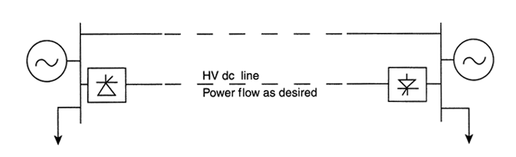
    <figcaption><b>(b) power flow control with HVDC</b></figcaption>
</figure>

- With HVDC, power flows as ordered by the operator, because with HVDC power electronics converters power is electronically controlled.
- Also, because power is electronically controlled, the HVDC line can be used to its full thermal capacity if adequate converter capacity is provided.

As alternative FACTS Controllers, the following figures show one of the transmission lines with different types of series type FACTS Controllers.

<table style="margin: 20px auto;">
	<tr>
		<td>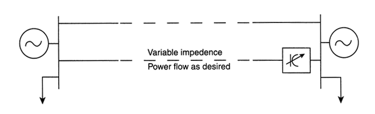</td>
	</tr>
	<tr>
		<td style="text-align:center"><b>(c) power flow control with variable impedance</b></td>
	</tr>
	<tr>
		<td>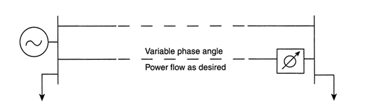</td>
	</tr>
	<tr>
		<td style="text-align:center"><b>(d) power flow control with variable phase angle</b></td>
	</tr>
</table>

- By means of controlling impedance (c) or phase angle (d), a FACTS controller can control the power flow as required.

> Suppose the lines AB, BC, and AC have continuous ratings of 1000 MW, 1250 MW, and 2000 MW, respectively, and have emergency ratings of twice those numbers for a sufficient time to allow rescheduling of power in case of loss of one of these lines.

If one of the generators is generating 2000 MW and the other 1000 MW, a total of 3000 MW would be delivered to the load center. For the impedances shown, the three lines would carry 600, 1600, and 1400 MW, respectively, as shown in Figure (a).

<figure style="margin: 20px auto; text-align: center;">

<figcaption><b>(a) system diagram</b></figcaption>
</figure>

Such a situation would overload line BC (loaded at 1600 MW for its continuous rating of 1250 MW), and therefore generation would have to be decreased at B, and increased at A, in order to meet the load without overloading line BC.

If a capacitor whose reactance is - 5 ohms is inserted to line AC Figure (b), it reduces the line’s impedance from 10 Q to 5 Q, so that power flow through the lines AB, BC, and AC will be 250,1250, and 1750 MW, respectively.
<figure style="margin: 20px auto; text-align: center;">
  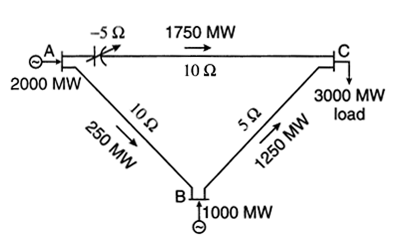
  <figcaption><b>(b) system diagram with Thyristor-Controlled Series Capacitor in line AC</b></figcaption>
</figure>
It is clear that if the series capacitor is adjustable, then other power-flow levels may be realized in accordance with the ownership, contract, thermal limitations, transmission losses, and a wide range of load and generation schedules.

Similar results may be obtained by increasing the impedance of one of the lines in the same meshed configuration by inserting a7 Q reactor (inductor) in series with line AB Figure (c).
<figure style="margin: 20px auto; text-align: center;">
  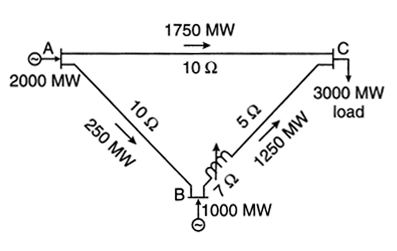
  <figcaption><b>(c) system diagram with Thyristor-Controlled Series Reactor in line BC</b></figcaption>
</figure>
Again, a series inductor that is partly mechanically and partly thyristorcontrolled, it could serve to adjust the steady-state power flows as well as damp unwanted oscillations.

As another option, a thyristor-controlled phase-angle regulator could be installed instead of a series capacitor or a series reactor in any of the three lines to serve the same purpose.
<figure style="margin: 20px auto; text-align: center;">
  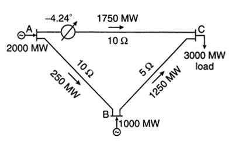
  <figcaption><b>(d) system diagram with Thyristor-Controlled Phase Angle Regulator in line AC</b></figcaption>
</figure>
In Figure (d), the regulator is installed in the third line to reduce the total phase angle difference along the line from 8.5 degrees to 4.26 degrees.

As before, a combination of mechanical and thyristor control of the phase-angle regulator may minimize cost.

<!--
<table style="border-collapse: collapse; width: 100%;">
<tr>
	<td style="border: none; width: 50%;">

If one of the generators is generating 2000 MW and the other 1000 MW, a total of 3000 MW would be delivered to the load center. For the impedances shown, the three lines would carry 600, 1600, and 1400 MW, respectively, as shown in Figure (a).

<figure style="margin: 20px auto; text-align: center;">

<figcaption><b>(a) system diagram</b></figcaption>
</figure>

Such a situation would overload line BC (loaded at 1600 MW for its continuous rating of 1250 MW), and therefore generation would have to be decreased at B, and increased at A, in order to meet the load without overloading line BC.

	</td>
	<td style="border: none; width: 50%;">

If a capacitor whose reactance is - 5 ohms is inserted to line AC Figure (b), it reduces the line’s impedance from 10 Q to 5 Q, so that power flow through the lines AB, BC, and AC will be 250,1250, and 1750 MW, respectively.
<figure style="margin: 20px auto; text-align: center;">

<figcaption><b>(b) system diagram with Thyristor-Controlled Series Capacitor in line AC</b></figcaption>
</figure>
It is clear that if the series capacitor is adjustable, then other power-flow levels may be realized in accordance with the ownership, contract, thermal limitations, transmission losses, and a wide range of load and generation schedules.

	</td>
</tr>
<tr>
	<td style="border: none; width: 50%;">

Similar results may be obtained by increasing the impedance of one of the lines in the same meshed configuration by inserting a7 Q reactor (inductor) in series with line AB Figure (c).
<figure style="margin: 20px auto; text-align: center;">

<figcaption><b>(c) system diagram with Thyristor-Controlled Series Reactor in line BC</b></figcaption>
</figure>
Again, a series inductor that is partly mechanically and partly thyristorcontrolled, it could serve to adjust the steady-state power flows as well as damp unwanted oscillations.

	</td>
	<td style="border: none; width: 50%;">

As another option, a thyristor-controlled phase-angle regulator could be installed instead of a series capacitor or a series reactor in any of the three lines to serve the same purpose.
<figure style="margin: 20px auto; text-align: center;">

<figcaption><b>(d) system diagram with Thyristor-Controlled Phase Angle Regulator in line AC</b></figcaption>
</figure>
In Figure (d), the regulator is installed in the third line to reduce the total phase angle difference along the line from 8.5 degrees to 4.26 degrees.

As before, a combination of mechanical and thyristor control of the phase-angle regulator may minimize cost.

	</td>
</tr>
</table>
-->

## Limits of TL loading capability

Basically, there are three kinds of limitations
- **Thermal**
- **Dielectric**
- **Stability**

### Thermal
- Thermal capability of an overhead line is a function of the ambient temperature, wind conditions, condition of the conductor, and ground clearance.
- It varies perhaps by a factor of 2 to 1 due to the variable environment and the loading history.

### Dielectric
- Dielectric From an insulation point of view, many lines are designed very conservatively. For a given nominal voltage rating, it is often possible to increase normal operation by +10% voltage (i.e., 500 kV-550 kV) or even higher.
- Care is then needed to ensure that dynamic and transient over voltages are
within limits.

### Stability
- There are a number of stability issues that limit the transmission capability including:
	- Transient stability
	- Dynamic stability
	- Steady-state stability
	- Frequency collapse
	- Voltage collapse
	- Sub synchronous resonance

## Power Flow and Dynamic Stability

A simplified case of power flow on a transmission line shown in (a).

<figure style="margin: 20px auto; text-align: center;">
	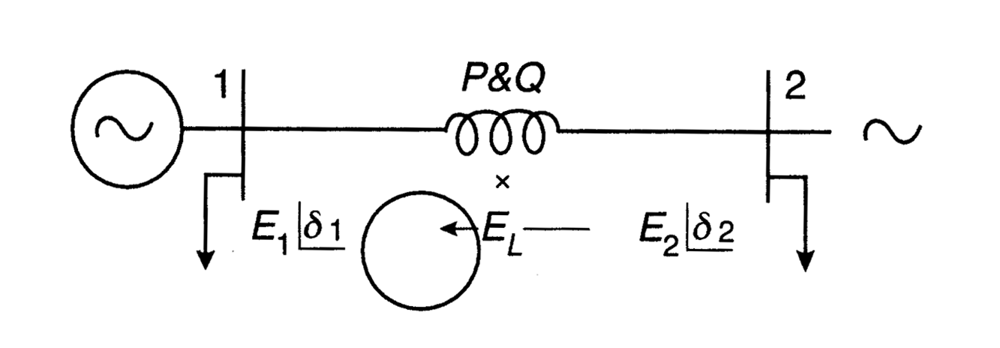
	<figcaption><b>(a) simple two-machine system</b>
	</figcaption>
</figure>

Locations 1 and 2 could be any transmission substations connected by a transmission line.

Substations may have loads, generation, or may be interconnecting points on the system and for simplicity they are assumed to be stiff busses. $E_1$ and $E_2$ are the magnitudes of the bus voltages with an angle $\delta$ between the two. The line is assumed to have inductive impedance $X$. and the line resistance and capacitance are ignored.

As shown in the phasor diagram (b) the driving voltage drop in the line is the phasor difference $E_L$ between the two line voltage phasors, $E_1$ and $E_2$.

<figure style="margin: 20px auto; text-align: center;">
	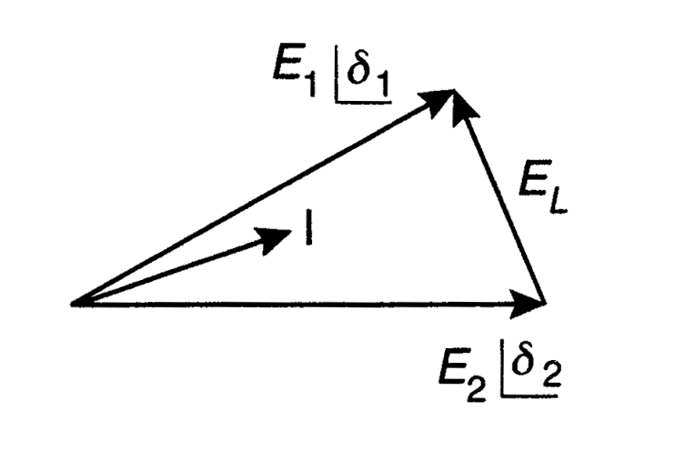
	<figcaption><b> (b) current flow perpendicular to the driving voltage</b>
	</figcaption>
</figure>

The line current magnitude is given by:

$$I=E_{L}/X,\,\mathrm{and\ lags}\,E_{L}\,\mathrm{by}\,90^{\circ}$$

The current flow phasor is perpendicular to the driving voltage (90° phase lag). If the angle between the two bus voltages is small, the current flow largely represents the active power.

Increasing or decreasing the inductive impedance of a line will greatly affect the active power flow.

**Thus impedance control**, which in reality provides current control, can be the most cost effective means of controlling the power flow. With appropriate control loops, it can be used for power flow control and/or angle control for stability.

Figure (d) shows the half sinewave curve of active power increasing to a peak with an increase in $\delta$ to 90 degrees.

<figure style="margin: 20px auto; text-align: center;">
	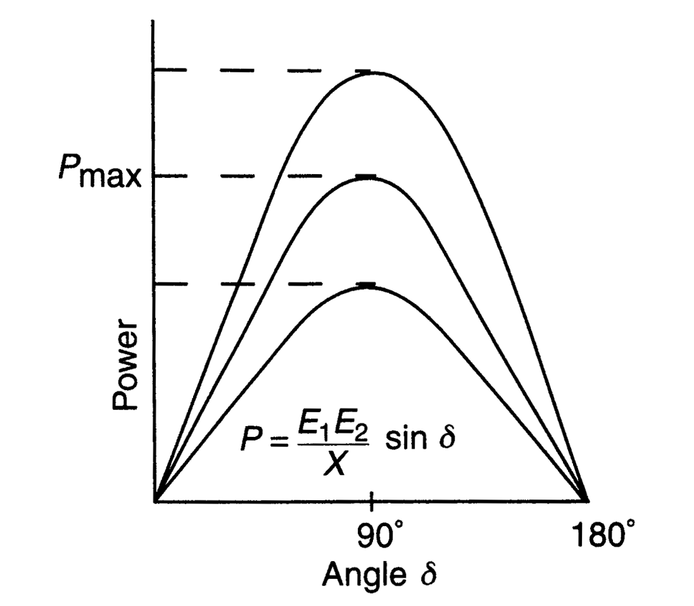
	<figcaption><b> (d) power angle curves for different values of X</b>
	</figcaption>
</figure>

Power then falls with further increase in angle, and finally to zero at $\delta=180^{\circ}$.

It is easy to appreciate that without high-speed control of any of the parameters $E_{1},\;E_{2},\;E_{1}-E_{2},\;X\mathrm{\,and}\;\delta$, the transmission line can be utilized only to a level well below that corresponding to 90 degrees.

This is necessary, in order to maintain an adequate margin needed for transient and dynamic stability and to ensure that the system does not collapse following the outage of the largest generator and/or a line.

Equations used: 

$$P_{1}=E_{1}\left(E_{2}\sin\,\delta\right)/X$$

$$P_{2}=E_{2}\left(E_{1}\sin\;\delta\right)/X$$

$$Q_{1}=E_{1}(E_{1}-E_{2}\cos\delta)/X$$

$$Q_{2}=E_{2}\left(E_{2}-E_{1}\cos\delta\right)/X$$

Power/current flow can also be controlled by **regulating the magnitude of voltage** phasor $E_1$ or voltage phasor $E_2$.

However, it is seen from (e) that with change in the magnitude of $E_1$ the magnitude of the driving voltage phasor $E_2 - E_2$ does not change by much, but its phase angle does.

<figure style="margin: 20px auto; text-align: center;">
	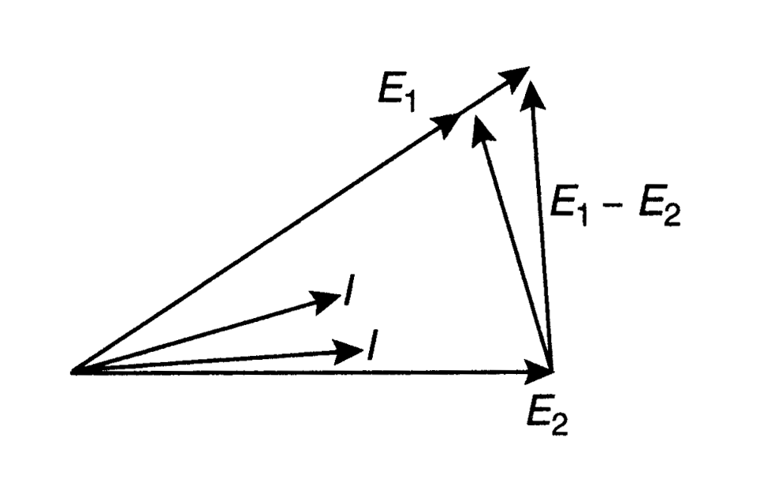
	<figcaption><b> (e) regulating voltage magnitude mostly changes reactive power</b>
	</figcaption>
</figure>

This also means that regulation of the magnitude of voltage phasor $E_1$ and/or $E_2$ has much more **influence over the reactive power flow** than the active power flow.

Current flow and hence power flow can also be changed by **injecting voltage in series with the line**.

<figure style="margin: 20px auto; text-align: center;">
	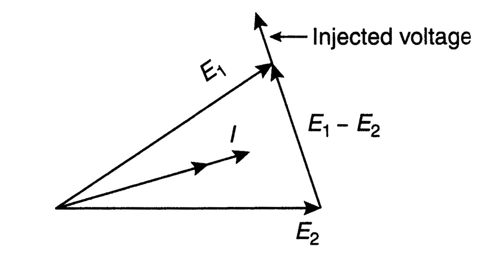
	<figcaption><b> (f) injecting voltage phasor in series with the line</b>
	</figcaption>
</figure>

It is seen from (f) that when the injected voltage is in phase quadrature with the current (which is approximately in phase with the driving voltage), it directly influences the magnitude of the current flow, and with small angle **influences substantially the active power flow**.

All of these can be completely achieved by FACTs:
- Impedance control
- Regulating the magnitude of voltage
- Injecting voltage in series with the line

## Basic Types of FACTs Controllers

**FACTS** is an acronym for Flexible AC Transmission System and it is an application of power electronic devices to electrical transmission system.

**The IEEE definition for FACTS controller is stated as**, it is a power electronic based system and other static equipment that provides the control of one or more AC transmission parameters (such as voltage, impedance, phase angle and power).

In general, FACTS Controllers can be divided into four categories:
- Series Controllers
- Shunt Controllers
- Combined series-series Controllers
- Combined series-shunt Controllers

<figure style="margin: 20px auto; text-align: center;">
	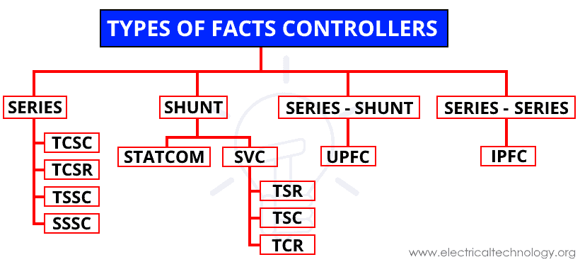
	<figcaption><b>Types of FACTs Controllers</b>
	</figcaption>
</figure>

### Series Controllers

In this, various compensation or FACTS devices (which can be either switched or controlled) are connected in series with the transmission lines at particular nodes.
<figure style="margin: 20px auto; text-align: center;">
	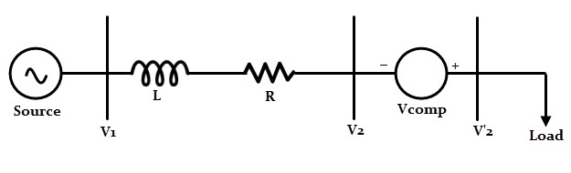
</figure>

This compensation will give more control of power flow through the line and also improves the dynamic stability limit of the power system.

<figure style="margin: 20px auto; text-align: center;">
	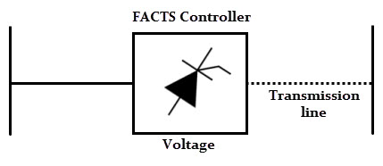
</figure>

These controllers could be variable impedance such as a reactor or capacitor or a power electronic based variable source. Examples of the series controllers include SSSC, TCSR, IPFC, TSSC, TCSC, and TCSR.

### Shunt Controllers

These controllers inject a current into the system at the point of connection. If this current is in phase quadrature with the line voltage, a shunt controller consumes or supplies variable reactive power to the network.
<figure style="margin: 20px auto; text-align: center;">
	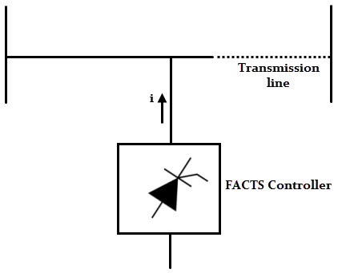
</figure>
Similar to the series connected controllers, these controllers could be a variable reactor or capacitor or a power electronic based variable source. Examples of the shunt controllers include TCR, STATCOM, TSR, TCBR and TSC.

### Combined series-series controllers
These controllers are the combination of individual series controllers that are controlled in a coordinated manner in multiple power transmission systems.

Or these could be a unified controllers in which separate series controllers are employed in each line for series reactive power compensation and also to transfer the real power among the lines via proper link.

<figure style="margin: 20px auto; text-align: center;">
	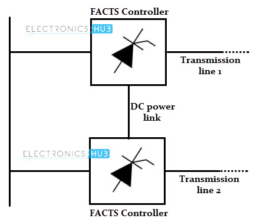
</figure>

Example of this controller is IPFC that balances the real and reactive power flow in the lines in order to maximize the power transmission.

### Combined series-shunt controllers

These are the combination of separate series and shunt controllers that are controlled in a coordinate manner or a unified power flow controller (UPFC) with series and shunt elements.

These combined controllers inject current into the system with series part of the controller and voltage in series in the line with shunt part of the controller.
<figure style="margin: 20px auto; text-align: center;">
	
</figure>

Examples of these controllers include TCPST, UPFC and TCPAR.

### Thyristor controlled Reactor (TCR)

It consists of a fixed reactor in series with bidirectional thyristor switches.
<figure style="margin: 20px auto; text-align: center;">
	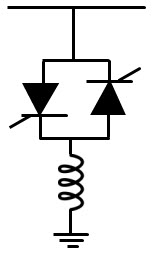
</figure>

The impedance of this device varied in a continuous manner by varying the conduction angles of thyristors.

### Thyristor Switched Reactor (TSR)
It is a special case of a TCR where phase control of the current is not exercised, instead the reactor is switched such that thyristors are either fully ON or OFF as in case of TSC.

<figure style="margin: 20px auto; text-align: center;">
	
</figure>

The advantage of TSR over TCR is that no harmonics current generation.

Also, this controller use thyristors without firing control and hence lower cost and losses.

### Thyristor Switched Capacitor (TSC)
It consists of a shunt connected capacitor which is connected in series with bidirectional thyristor switches.

<figure style="margin: 20px auto; text-align: center;">
	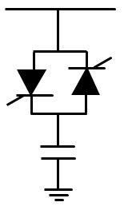
</figure>

The impedance or reactance of this device is varied in stepwise manner by controlling the thyristors either in a zero or full conduction operation. This controller offers no harmonics, no transients and low losses.

### Static Var Compensator

It is a shunt type controller which controls the power flow in transmission system and improves the transient stability of power grids.
<figure style="margin: 20px auto; text-align: center;">
	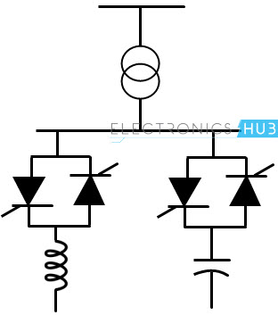
</figure>
This controller regulates the voltage at its terminals by controlling the amount of reactive power injected into or absorbed from the power system.

### STATCOM
STATCOM means static synchronous compensator and it has the similar characteristics to that of synchronous condenser but it has no inertia as it is an electronic device.

<figure style="margin: 20px auto; text-align: center;">
	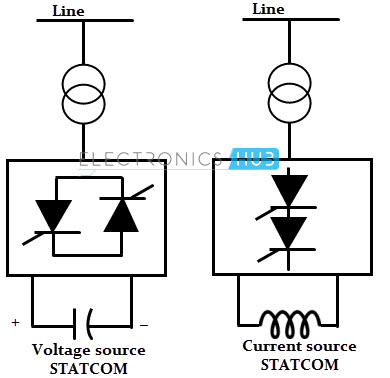
</figure>

It consists of a solid state voltage source inverter coupled with a transformer and this arrangement is tied to a transmission line.

This arrangement supplies or draws reactive power at a faster rate compared with synchronous motor condenser.

### Thyristor Controlled Series Capacitor (TCSC)

It is a capacitive reactance compensator. 

It consists of a series capacitor bank which connected in parallel with a thyristor controlled reactor that provides a smooth variable series capacitive reactance.
<figure style="margin: 20px auto; text-align: center;">
	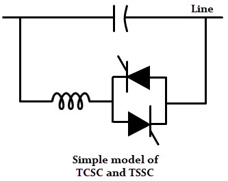
</figure>

The total impedance of the system can be varied by changing the conduction angle of the thyristors and hence the circuit becomes either inductive or capacitive.

If the total circuit impedance is inductive, the fault current is limited by this controller.

### Thyristor Controlled Series Reactor (TCSR)

It is an inductive reactance compensator which consists of a series reactor in parallel with thyristor switched reactor. This controller provides a smooth variable inductive reactance.
<figure style="margin: 20px auto; text-align: center;">
	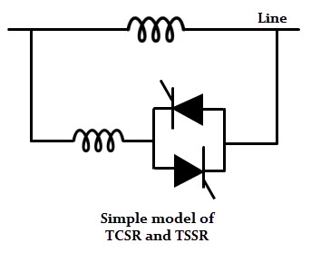
</figure>

When the thyristors firing angle is 1800, the reactor stops conducting and hence the uncontrolled reactor only is in series with the line that acts as a fault current limiter.

If the firing angle is below 1800, the net (or overall) inductance decreases, thereby voltage is controlled in the network.

### Thyristor Switched Series Reactor (TSSR)

Similar to TCSR, TSSR is also an inductive reactance compensator but it provides the stepwise control.
<figure style="margin: 20px auto; text-align: center;">
	
</figure>

This controller switches thyristors such that they are either fully ON or fully OFF in order to achieve stepped series inductance.

### Static Series Synchronous Compensator (SSSC)
It is a series version of STATCOM and it is an advanced kind of control series compensation.
<figure style="margin: 20px auto; text-align: center;">
	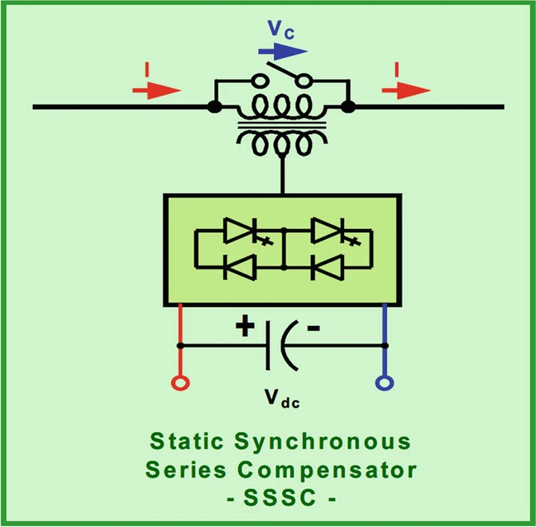
</figure>

It produces the output voltage in quadrature with the line current such that the overall reactive voltage drop across the line is increased or decreased.

Although it is like a STATCOM, the output voltage is in series with the line and hence it controls the voltage across the line, so its impendence.

It has a capability to induce both inductive and capacitive voltage in series with the line and hence the power control.

### Unified Power Flow Controller (UPFC)
UPFC is the combination of STATCOM and SSSC which are coupled by via a common DC link. 
<figure style="margin: 20px auto; text-align: center;">
	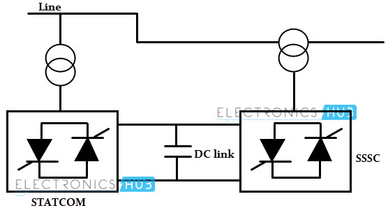
</figure>

It can exhibit the characteristics of both SSSC with series voltage injection and STATCOM with shunt current injection, with added features.

It has a unique ability to perform independent control of real and reactive power flow

Also, these can be controlled to provide concurrent reactive and real power series line compensation without use of an external energy source.

### Interline Power Flow Controller (IPFC)

It is the new technique for effective power flow and compensation management of multiline transmission systems.
<figure style="margin: 20px auto; text-align: center;">
	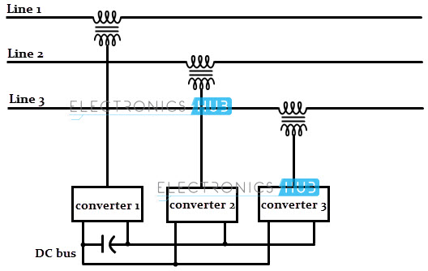
</figure>

It consists of a number of converters which are connected with a common DC link and each converter is provided for series compensation for a selected transmission line.

In addition to the reactive power compensation, this controller can able to transfer real power among the transmission lines due to a common DC link.

So it is possible to equalize both real and reactive power between the lines.

## Power Electronics in FACTs

Power electronics have a widely spread range of applications from electrical machine drives to excitation systems, industrial high current rectifiers for metal smelters, frequency controllers or electrical trains.

FACTS-devices are just one application beside others, but use the same technology trends.

It has started with the first Thyristor rectifiers in 1965 and goes to the nowadays modularized IGBT or IGCT voltage source converters.

Since the first development of a Thyristor by General Electric in 1957, the targets for power semiconductors are low switching losses for high switching rates and minimal conduction losses.

The innovation in the FACTS area is mainly driven by these developments. Today, there are Thyristor and Transistor technologies available.

### Thyristor

The Thyristor is a device, which can be triggered with a pulse at the gate and remains in the on-stage until the next current zero crossing.

Therefore only one switching per half-cycle is possible, which limits the controllability.

<figure style="margin: 20px auto; text-align: center;">
	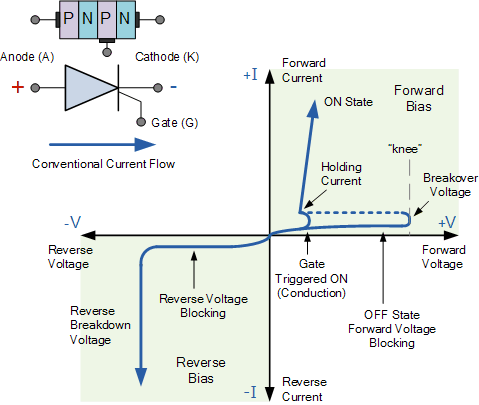
	<figcaption><b>I-V Characteristics Curves</b>
	</figcaption>
</figure>

Thyristors have the highest current and blocking voltage. This means that fewer semiconductors need to be used for an application.

<figure style="margin: 20px auto; text-align: center;">
	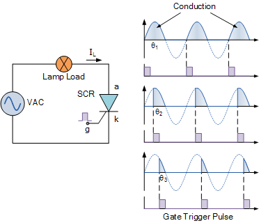
	<figcaption><b>Phase Control</b>
	</figcaption>
</figure>

Thyristors are used as switches for capacities or inductances, in converters for reactive power compensators or as protection switches for less robust power converters.

<figure style="margin: 20px auto; text-align: center;">
	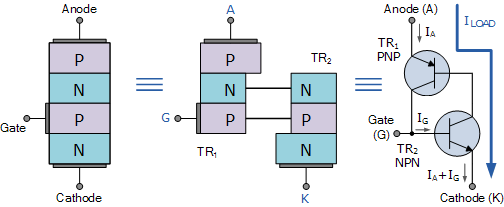
	<figcaption><b>A Thyristor Two Transistor Analogy</b>
	</figcaption>
</figure>

The Thyristors are still the devices for applications with the highest voltage and power levels. They are part of the mostly used FACTS-devices up to the biggest HVDC-Transmissions with a voltage level above 500 kV and power above 3000 MVA.

### Thyristor and GTO

A normal thyristor or conventional thyristor is used as an ideal switch for power electronic circuits. However, for turning off the device, a communication circuit is required, which increases the complexity and weight of the circuit.

To overcome these limitations, the Gate Turn-Off Thyristor (GTO) was introduced. GTOs use a gate signal to turn on and off, eliminating the need for a communication circuit.

<figure style="margin: 20px auto; text-align: center;">
	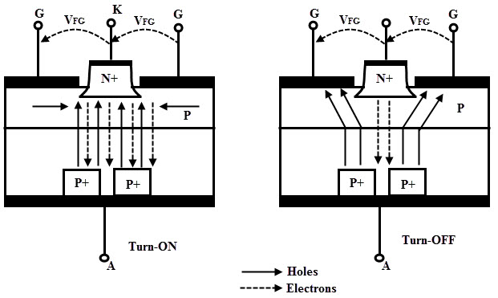
	<figcaption><b>Principle of Operation</b>
	</figcaption>
</figure>

#### Turn-On Operation

The turn-on operation of a GTO is similar to that of a conventional thyristor. When a positive gate signal is applied, the hole current injection from the gate forward biases the cathode p-base junction. This results in the emission of electrons from the cathode towards the anode terminal, inducing hole injection from the anode terminal into the base region. This injection of holes and electrons continues until the GTO comes into the conduction state.

In contrast, the conduction in a thyristor starts initially by turning on the area of the cathode adjacent to the gate terminal. The remaining area comes into conduction by plasma spreading.

#### Turn-Off Operation

To turn off a conducting GTO, a reverse bias is applied at the gate by making the gate negative with respect to the cathode. A part of the holes from the P base layer is extracted through the gate, which suppresses the injection of electrons from the cathode. In response to this, more hole current is extracted through the gate, resulting in more suppression of electrons from the cathode. Eventually, the voltage drop across the p base junction causes the gate cathode junction to reverse bias, turning off the GTO.

The GTO can be turned off by the application of reverse gate current, which can be either step or ramp drive. The GTO can be turned off without reversing the anode voltage. During turn-off, the GTO can block a rated forward voltage only.

<figure style="margin: 20px auto; text-align: center;">
	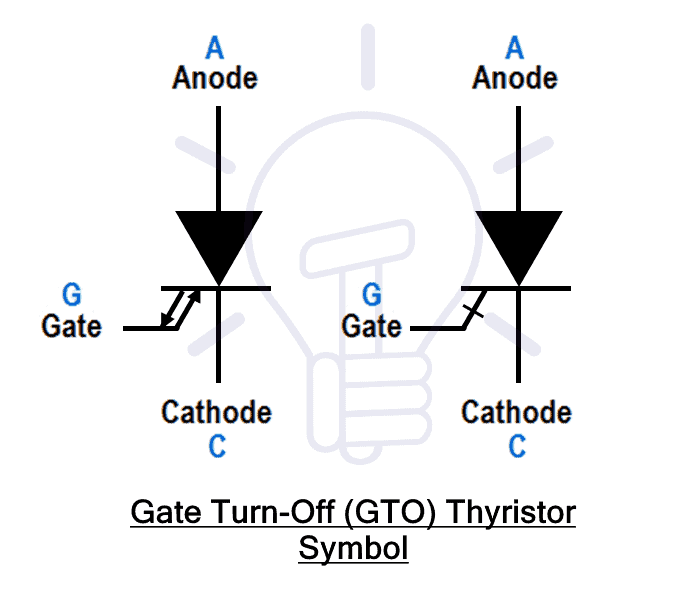

</figure>

#### Comparison with Thyristor

Compared to thyristors, GTOs have the following advantages:

- No communication circuit is required for turning off the device.
- GTOs can be turned off by the application of reverse gate current, which can be either step or ramp drive.
- GTOs can be turned off without reversing the anode voltage.

However, GTOs also have some limitations:

- GTOs have a lower voltage rating than thyristors.
- GTOs have a lower current rating than thyristors.
- GTOs have a higher on-state voltage drop than thyristors.
- The drive circuit for GTOs is more difficult than for thyristors.

<table style="margin: 20px auto;">
	<tr>
		<td><figure style="margin: 20px auto; text-align: center;">
	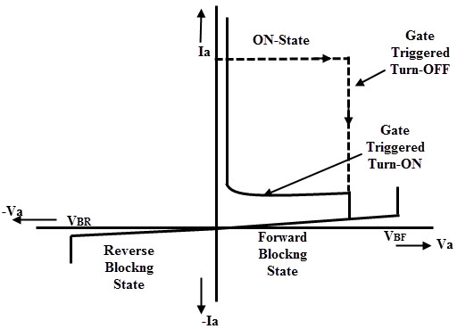
	<figcaption><b>GTO I-V Characteristics</b>
	</figcaption>
</figure></td>
		<td><figure style="margin: 20px auto; text-align: center;">
	
	<figcaption><b>Thyristor I-V Characteristics</b>
	</figcaption>
</figure></td>
	</tr>
</table>

### BJT and IGBT
Bipolar Junction Transistor (BJT) and Insulated Gate Bipolar Transistor (IGBT) are two types of transistors that are used in electronic circuits to control the currents.

<figure style="margin: 20px auto; text-align: center;">
	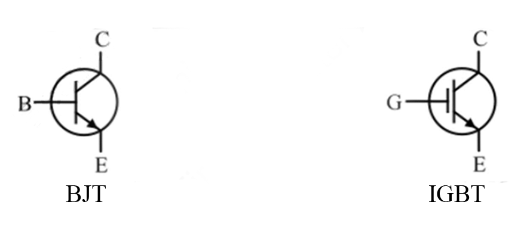
</figure>

#### BJT
BJT stands for Bipolar Junction Transistor. The BJT is a three layer, three terminal semiconductor device which is used in the electronic circuit for switching and amplification of signals

<table style="margin: 20px auto;">
	<tr>
		<td><figure style="margin: 20px auto; text-align: center;">
	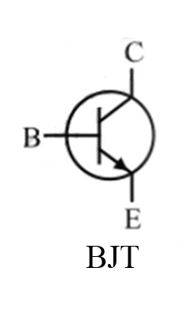
</figure></td>
		<td><figure style="margin: 20px auto; text-align: center;">
	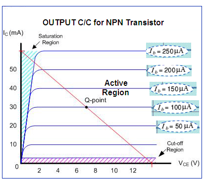
</figure></td>
	</tr>
</table>

#### IGBT
IGBT stands for Insulated Gate Bipolar Transistor. An IGBT is also a three terminal semiconductor device used for switching purposes. The IGBT is a type of transistor that has ability to handle large amount of power and has high switching speed which makes it more efficient than a BJT. The three terminals of the IGBT are: emitter (E), gate (G) and collector (C).

<table style="margin: 20px auto;">
	<tr>
		<td><figure style="margin: 20px auto; text-align: center;">
	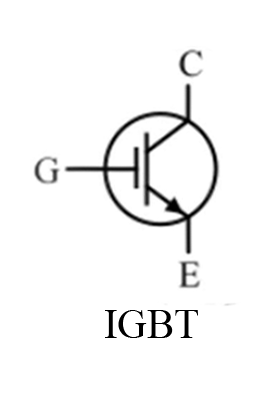
</figure></td>
		<td><figure style="margin: 20px auto; text-align: center;">
	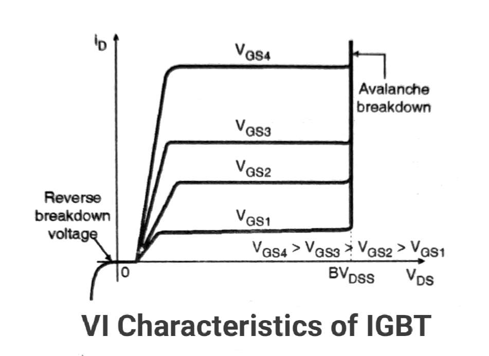
</figure></td>
	</tr>
</table>

### Comparisons

<figure style="margin: 20px auto; text-align: center;">
	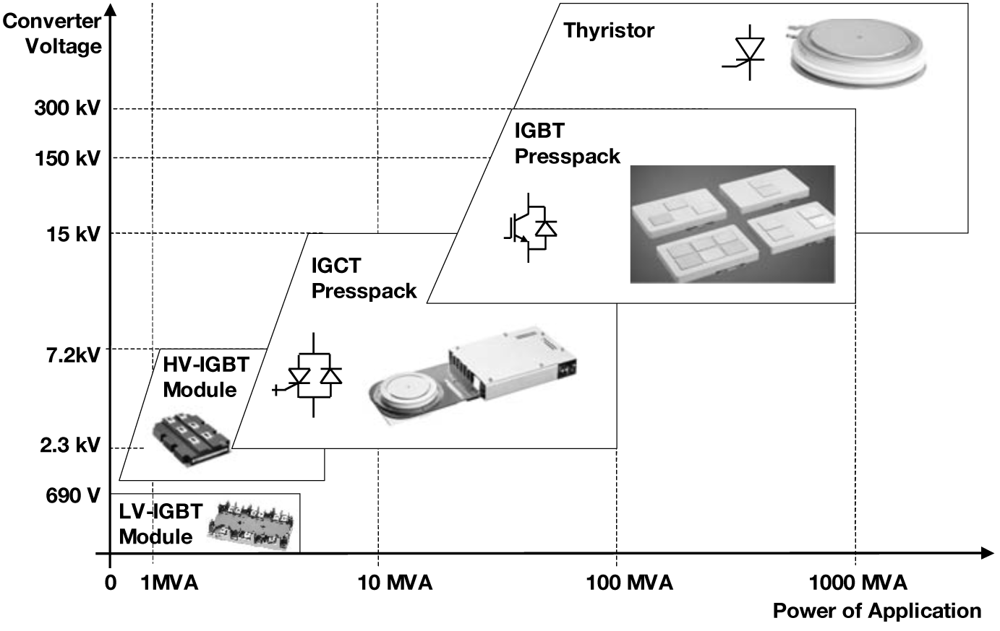
	<figcaption><b>Ranges of converter voltages and power of applications for power semiconductors</b>
	</figcaption>
</figure>

|  	    | Thyristor | GTO | BJT | MOSFET | IGBT |
|:---------:|:----------:|:----------:|:----------:|:----------:|:----------:|
| Availability | Early 60s | Mid 80s | Late 70s | Early 80s | Late 80s |
| Voltage Ratings | 5kV | 5kV | 1kV | 500V | 3.3kV |
| Current Ratings | 4kA | 5kA | 400A | 200A | 1.2kA |
| Switching Frequencies | low | 2kHz | 5kHz | 1MHz | 100kHz |
| On-state voltage drop | 2V | 2-3V | 1-2V | I*Rds(on) 4.5V | 2-3V |
| Drive Circuit | Simple | Very difficult | Difficult | Very simple | Very simple |
| Comments | Cannot turn-off using gate signals | King in very high power | Phasing out in new products | Good performance in high frequency | Best overall performance |

<b>Table comparing different types of power electronic devices based on various parameters</b>

## Practical Cases

<figure style="margin: 20px auto; text-align: center;">
	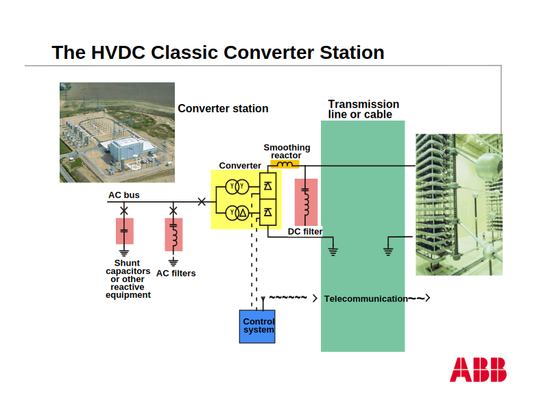
</figure>
<figure style="margin: 20px auto; text-align: center;">
	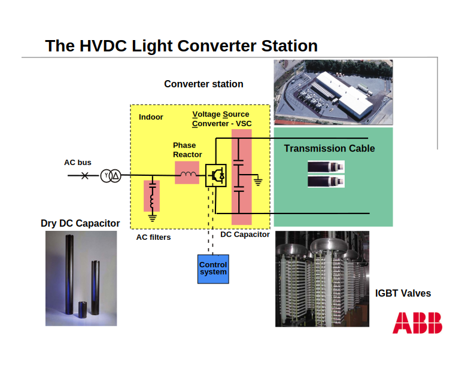
</figure>
<figure style="margin: 20px auto; text-align: center;">
	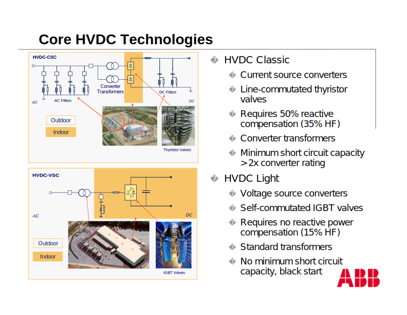
</figure>
<figure style="margin: 20px auto; text-align: center;">
	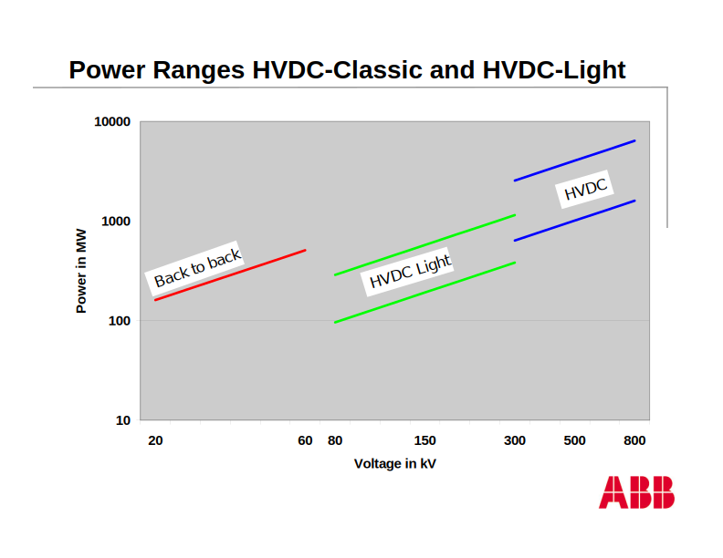
</figure>

